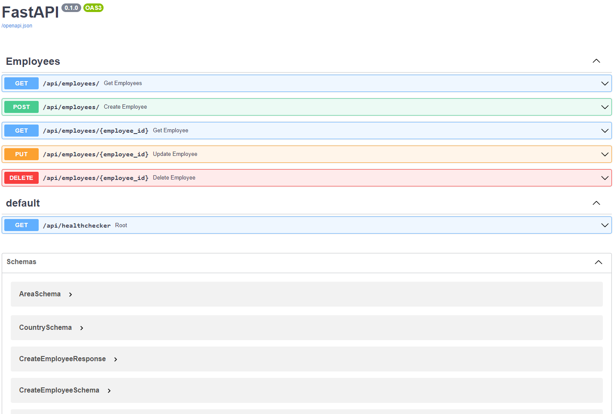
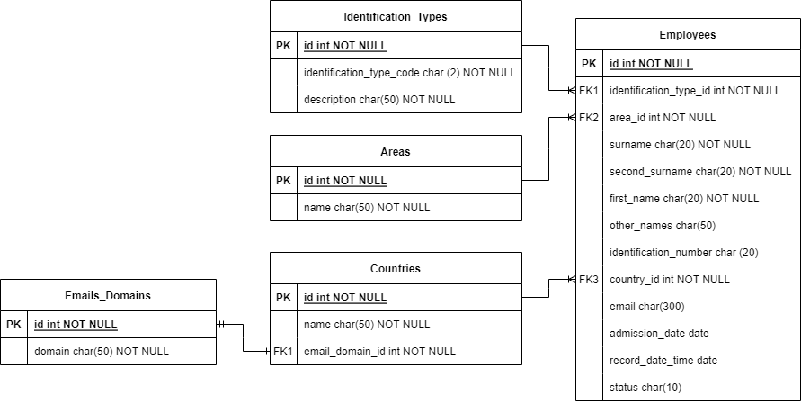

# CIDENET - API

## Introduction

+ It is recommended to have installed on your computer [Python 3.10.1](https://www.python.org/downloads/release/python-3101/)
+ The API was created with the framework [FastAPI](https://fastapi.tiangolo.com/)
+ The connection to the database is achieved with the ORM [SQLAlchemy](https://www.sqlalchemy.org/blog/2022/06/24/sqlalchemy-1.4.39-released/)
+ The postgresql database was used [Postgresql 15.1](https://www.postgresql.org/download/)
+ To migrate the database, the Python alembic library was used [Alembic](https://pypi.org/project/alembic/)

## Prerequisitos

+ It is recommended to have installed on your computer [Python 3.10.1](https://www.python.org/downloads/release/python-3101/)
Create a `.env` file in the root directory of the project, you can refer `.env.example` for this.

## Project configuration with python virtual env

+ Enable python virtual environment and then install project dependencies.
```commandline
python -m venv ./venv
.\venv\Scripts\activate
pip install -r requirements.txt
```
+ Migrate database.
```commandline
alembic upgrade head
```
+ Run uvicorn server.
```commandline
uvicorn app.main:app --host localhost --port 8000 --reload
```

## Project configuration with Docker

+ In order to complete the next steps you must need to have installed docker in your local machine.
Once docker is installed you can run the following command:
```commandline
docker-compose up -d
```

# Endpoints

+ The endpoints to consume the services are:
```commandline
GET http://localhost:8000/api/employees/
```
```commandline
GET http://localhost:8000/api/employees/{employee_id}
```
```commandline
POST http://localhost:8000/api/employees/
```
```commandline
PUT http://localhost:8000/api/employees/{employee_id}
```
```commandline
DELETE http://localhost:8000/api/employees/{employee_id}
```

# API Documentation

```commandline
GET http://localhost:8000/docs/
```




# Entity relationship diagram


